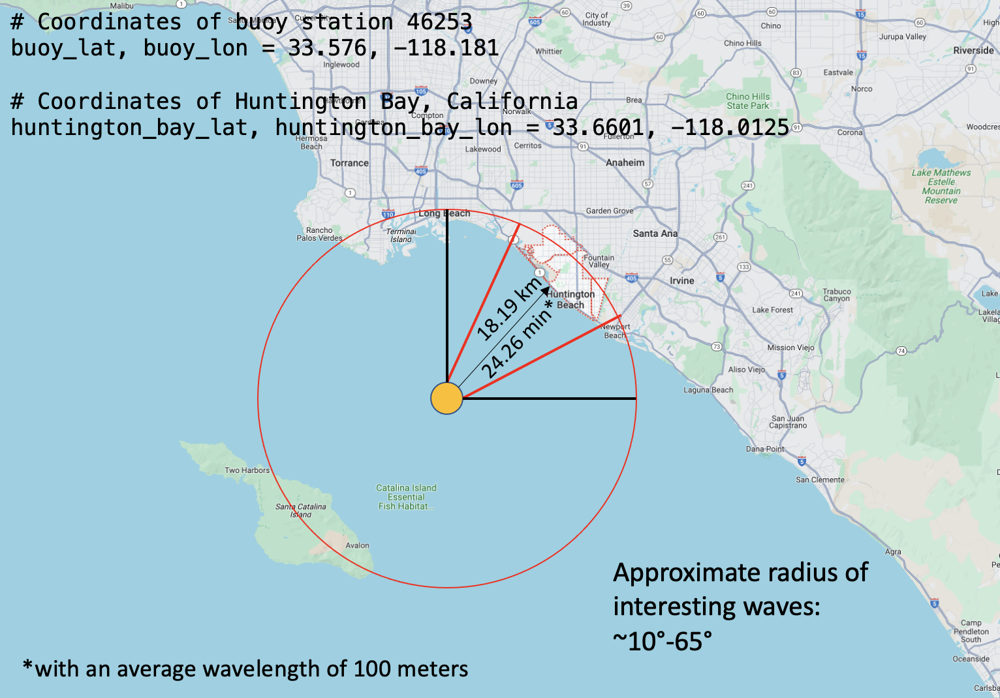

# Surf Prediction at Huntington Beach, California

## About
This repository hosts a project aimed at predicting the surf quality at Huntington Beach in California, USA. Utilizing a variety of data sources and machine learning techniques, the project provides insights into surf conditions, aiding surfers and researchers alike.

## Dataset
This project leverages a detailed dataset comprising information from two primary sources:
1. **NOAA Buoy 46253:** We have incorporated data from NOAA's buoy number 46253, which provides valuable maritime data including wave heights, sea temperatures, and wind conditions. The buoy's data can be accessed [here](https://www.ndbc.noaa.gov/station_page.php?station=46253&uom=M&tz=STN).
2. **City of Huntington Beach:** Additional data has been sourced from the City of Huntington Beach's official website, offering insights into local beach conditions. This information is available [here](https://www.huntingtonbeachca.gov/residents/beach_info/livebeachcondition.cfm).

Combining these two data sources provides a comprehensive view of the marine and beach environment, essential for surf quality prediction.

## Methodology
The first step in this project was to become familiar with the two datasources: 
1. **NOAA Buoy 46253:** 

The utilised data from NOAA contained the *wave height*, *the period*, and *the direction* of incoming waves at the buoy. The first task was to filter this data with only the relevant waves that will end up at the beach in Huntington. To accomplish this first the disred radius of incoming waves was calculated to be  ~10°-65°. Secondly, the estimated arrival time from the recorded buoy in the ocean to the wave reaching the shore had to be calculated which resulted in ~24 minutes. The refined data, by selecting only the waves directed towards the shore, and by incorporating the estimated time of their arrival at the shore made  the dataset that was stored on Hopsworks.

2. **Huntington Beach:**
The second datasource was the provided surf information provided by the city of huntington. For this feature group the website was scraped three times a day to ensure the latest surf quality at the beach.

3. **Merging the Data:**
To create a dataset that can be used to predict the surf quality at the Huntington beach, it was needed to merge the two created datasets into one. For this the Buoy data based on the estimated arrival time was merged with the surf quality recorded at the beach. The join was made based on an hour base. Again this feature group was stored on Hopsworks.

### Model
To predict the surf quality different models were tested. At the beginning a classification model was used to predict the surf quality, however since its poor performance and a better performance of a Linear Regression model the final used model is a Linear Regression model in which the surf quality is encoded into numbers.

## Results
The model's performance is evaluated based on its accuracy in predicting surf quality. The key metrics Mean Absolute Error (MAE) is included to quantify the model's predictive capabilities. However it must be said that the current merged dataset is realtively limited in size since, the data had to be scraped from scratch. The City of Huntington was contacted as well to see if it would be possible to get more historic data from the beach, but sadly this was not saved by the city. 

## Running the Code
To use this project:

The interactive UI can be found [here](https://huggingface.co/spaces/MischaTomasz/huntington_surf_prediction_ui) on Huggingface. The repositry for the UI is linked in this repository as well in *huntington_surf_prediction_ui*.
GitHub Actions is used to scrap the website of the city of Huntington, as well as to collect the buoy data, and create the predictions for the model.
